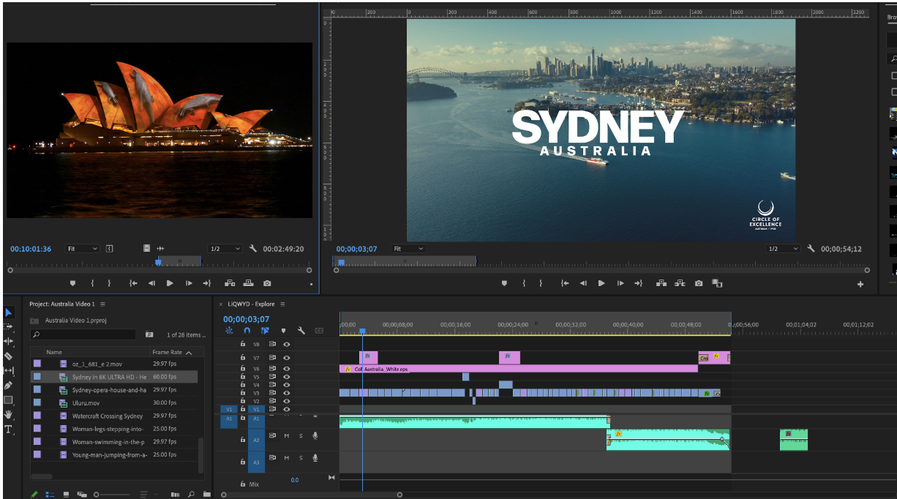

Below are two pictures of machines that would cut and paste together strands of film into one timeline to create a movie. This design originates from light tables that were used to look at the frames of the film and cut them into one timeline. This demonstrates how matching from a real-world system to an application. 

  

  

Film editing. (2023, September 7). In Wikipedia. https://en.wikipedia.org/wiki/Film_editing

Each row of the software represents a different component of the video from music, to effects, to the video itself. 

  

The depiction above digitally represents two older machines, where each row and column signifies a specific time and position in a video or movie. In the past, this manual and linear process was necessary before the advent of computers and software that allowed for non-linear editing.

In contemporary video editing practices for commercials and various projects, individuals typically initiate the process by importing subject clips onto a dedicated workstation. Editors then manually sift through each clip, engaging in the cut-and-paste process to compile the necessary content. In the Adobe suite, users can import Clip A into the timeline adjacent to Clip B. However, a notable drawback is that the highlighted portion must be manually dragged into the timeline, requiring substantial effort and time investment.

  

The issue becomes apparent in the highlighted section of Clip A, where the blue cursor in Clip B indicates the video's position. The proposed improvement suggests replacing the manual drag-and-drop action with a more efficient keystroke method. This adjustment would align with user expectations, enhancing the workflow of video editing by eliminating the time-consuming process of individually dragging and placing each clip onto the timeline.

To illustrate, a more streamlined workflow involves locating the desired position on Clip B within the main timeline. By selecting everything to the right of the blue cursor and moving it down and to the right, users can then employ a simple click to place Clip A onto the main timeline. This method proves to be more efficient than the traditional approach of dragging Clip A onto the timeline and subsequently searching for the appropriate placement. This feature aligns more closely with users' (**mental models**), as many may expect a straightforward click action to place clips on the timeline, similar to other software interfaces.

